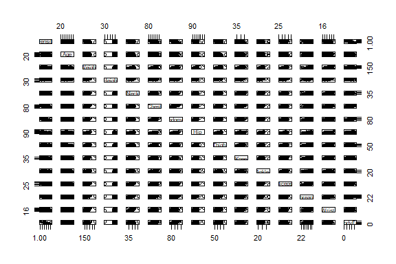
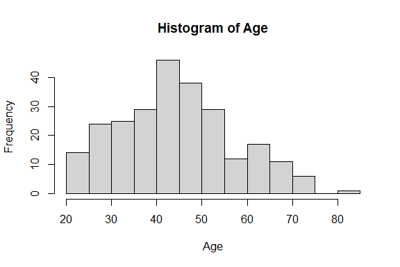
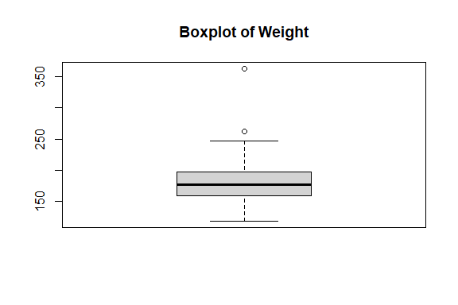
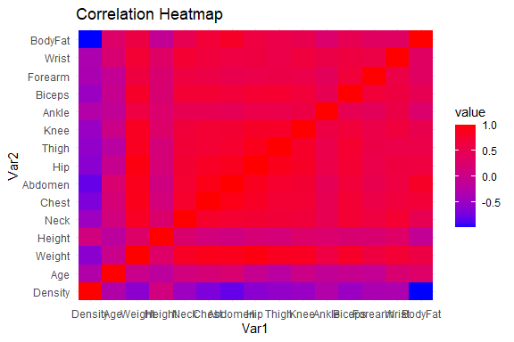
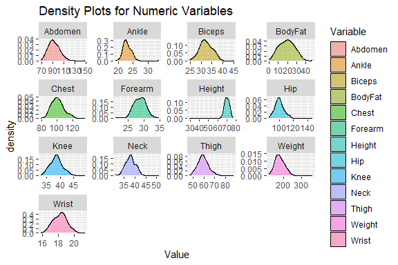

Body Fat Prediction
================
Trevor Okinda
2024

- [Student Details](#student-details)
- [Setup Chunk](#setup-chunk)
  - [Source:](#source)
  - [Reference:](#reference)
- [Exploratory Data Analysis](#exploratory-data-analysis)
  - [Load dataset](#load-dataset)
  - [Measures of Central Tendency](#measures-of-central-tendency)
  - [Measures of Distibution](#measures-of-distibution)
  - [Measures of Relationship](#measures-of-relationship)
  - [Plots](#plots)
- [Preprocessing and Data
  Transformation](#preprocessing-and-data-transformation)
  - [Missing Values](#missing-values)
- [Training Model](#training-model)
  - [Data Splitting](#data-splitting)
  - [Bootstrapping](#bootstrapping)
  - [Cross-validation](#cross-validation)
  - [Training Models](#training-models)
  - [Performance Comparison](#performance-comparison)
  - [Saving Model](#saving-model)

# Student Details

|                       |                     |
|-----------------------|---------------------|
| **Student ID Number** | 134780              |
| **Student Name**      | Trevor Okinda       |
| **BBIT 4.2 Group**    | C                   |
| **Project Name**      | Body Fat Prediction |

# Setup Chunk

**Note:** the following KnitR options have been set as the global
defaults: <BR>
`knitr::opts_chunk$set(echo = TRUE, warning = FALSE, eval = TRUE, collapse = FALSE, tidy = TRUE)`.

More KnitR options are documented here
<https://bookdown.org/yihui/rmarkdown-cookbook/chunk-options.html> and
here <https://yihui.org/knitr/options/>.

### Source:

The dataset that was used can be downloaded here: *\<<a
href="https://www.kaggle.com/datasets/fedesoriano/body-fat-prediction-dataset\"
class="uri">https://www.kaggle.com/datasets/fedesoriano/body-fat-prediction-dataset\</a>\>*

### Reference:

*\<fedesoriano. (2020). Body Fat Prediction Dataset. Retrieved from
Kaggle <a
href="https://www.kaggle.com/datasets/fedesoriano/body-fat-prediction-dataset\"
class="uri">https://www.kaggle.com/datasets/fedesoriano/body-fat-prediction-dataset\</a>\>  
Refer to the APA 7th edition manual for rules on how to cite datasets:
<https://apastyle.apa.org/style-grammar-guidelines/references/examples/data-set-references>*

# Exploratory Data Analysis

## Load dataset

``` r
# Load dataset
body_data <- read.csv("bodyfat.csv", colClasses = c(
  Density = "numeric",
  Age = "integer",
  Weight = "numeric",
  Height = "numeric",
  Neck = "numeric",
  Chest = "numeric",
  Abdomen = "numeric",
  Hip = "numeric",
  Thigh = "numeric",
  Knee = "numeric",
  Ankle = "numeric",
  Biceps = "numeric",
  Forearm = "numeric",
  Wrist = "numeric",
  BodyFat = "numeric"
))

# Display the structure of the dataset
str(body_data)
```

    ## 'data.frame':    252 obs. of  15 variables:
    ##  $ Density: num  1.07 1.09 1.04 1.08 1.03 ...
    ##  $ Age    : int  23 22 22 26 24 24 26 25 25 23 ...
    ##  $ Weight : num  154 173 154 185 184 ...
    ##  $ Height : num  67.8 72.2 66.2 72.2 71.2 ...
    ##  $ Neck   : num  36.2 38.5 34 37.4 34.4 39 36.4 37.8 38.1 42.1 ...
    ##  $ Chest  : num  93.1 93.6 95.8 101.8 97.3 ...
    ##  $ Abdomen: num  85.2 83 87.9 86.4 100 94.4 90.7 88.5 82.5 88.6 ...
    ##  $ Hip    : num  94.5 98.7 99.2 101.2 101.9 ...
    ##  $ Thigh  : num  59 58.7 59.6 60.1 63.2 66 58.4 60 62.9 63.1 ...
    ##  $ Knee   : num  37.3 37.3 38.9 37.3 42.2 42 38.3 39.4 38.3 41.7 ...
    ##  $ Ankle  : num  21.9 23.4 24 22.8 24 25.6 22.9 23.2 23.8 25 ...
    ##  $ Biceps : num  32 30.5 28.8 32.4 32.2 35.7 31.9 30.5 35.9 35.6 ...
    ##  $ Forearm: num  27.4 28.9 25.2 29.4 27.7 30.6 27.8 29 31.1 30 ...
    ##  $ Wrist  : num  17.1 18.2 16.6 18.2 17.7 18.8 17.7 18.8 18.2 19.2 ...
    ##  $ BodyFat: num  12.3 6.1 25.3 10.4 28.7 20.9 19.2 12.4 4.1 11.7 ...

``` r
# View the first few rows of the dataset
head(body_data)
```

    ##   Density Age Weight Height Neck Chest Abdomen   Hip Thigh Knee Ankle Biceps
    ## 1  1.0708  23 154.25  67.75 36.2  93.1    85.2  94.5  59.0 37.3  21.9   32.0
    ## 2  1.0853  22 173.25  72.25 38.5  93.6    83.0  98.7  58.7 37.3  23.4   30.5
    ## 3  1.0414  22 154.00  66.25 34.0  95.8    87.9  99.2  59.6 38.9  24.0   28.8
    ## 4  1.0751  26 184.75  72.25 37.4 101.8    86.4 101.2  60.1 37.3  22.8   32.4
    ## 5  1.0340  24 184.25  71.25 34.4  97.3   100.0 101.9  63.2 42.2  24.0   32.2
    ## 6  1.0502  24 210.25  74.75 39.0 104.5    94.4 107.8  66.0 42.0  25.6   35.7
    ##   Forearm Wrist BodyFat
    ## 1    27.4  17.1    12.3
    ## 2    28.9  18.2     6.1
    ## 3    25.2  16.6    25.3
    ## 4    29.4  18.2    10.4
    ## 5    27.7  17.7    28.7
    ## 6    30.6  18.8    20.9

``` r
# View the dataset in a separate viewer window
View(body_data)
```

## Measures of Central Tendency

``` r
# Mean for numeric variables
means <- sapply(body_data[, c("Density", "Age", "Weight", "Height", "Neck", "Chest", "Abdomen", "Hip", "Thigh", "Knee", "Ankle", "Biceps", "Forearm", "Wrist", "BodyFat")], mean)
means
```

    ##    Density        Age     Weight     Height       Neck      Chest    Abdomen 
    ##   1.055574  44.884921 178.924405  70.148810  37.992063 100.824206  92.555952 
    ##        Hip      Thigh       Knee      Ankle     Biceps    Forearm      Wrist 
    ##  99.904762  59.405952  38.590476  23.102381  32.273413  28.663889  18.229762 
    ##    BodyFat 
    ##  19.150794

``` r
# Median for numeric variables
medians <- sapply(body_data[, c("Density", "Age", "Weight", "Height", "Neck", "Chest", "Abdomen", "Hip", "Thigh", "Knee", "Ankle", "Biceps", "Forearm", "Wrist", "BodyFat")], median)
medians
```

    ##  Density      Age   Weight   Height     Neck    Chest  Abdomen      Hip 
    ##   1.0549  43.0000 176.5000  70.0000  38.0000  99.6500  90.9500  99.3000 
    ##    Thigh     Knee    Ankle   Biceps  Forearm    Wrist  BodyFat 
    ##  59.0000  38.5000  22.8000  32.0500  28.7000  18.3000  19.2000

## Measures of Distibution

``` r
# Standard deviation for numeric variables
sds <- sapply(body_data[, c("Density", "Age", "Weight", "Height", "Neck", "Chest", "Abdomen", "Hip", "Thigh", "Knee", "Ankle", "Biceps", "Forearm", "Wrist", "BodyFat")], sd)
sds
```

    ##     Density         Age      Weight      Height        Neck       Chest 
    ##  0.01903143 12.60203972 29.38915989  3.66285579  2.43091323  8.43047553 
    ##     Abdomen         Hip       Thigh        Knee       Ankle      Biceps 
    ## 10.78307680  7.16405767  5.24995203  2.41180459  1.69489340  3.02127375 
    ##     Forearm       Wrist     BodyFat 
    ##  2.02069117  0.93358493  8.36874041

``` r
# Range for numeric variables
ranges <- sapply(body_data[, c("Density", "Age", "Weight", "Height", "Neck", "Chest", "Abdomen", "Hip", "Thigh", "Knee", "Ankle", "Biceps", "Forearm", "Wrist", "BodyFat")], function(x) diff(range(x)))
ranges
```

    ##  Density      Age   Weight   Height     Neck    Chest  Abdomen      Hip 
    ##   0.1139  59.0000 244.6500  48.2500  20.1000  56.9000  78.7000  62.7000 
    ##    Thigh     Knee    Ankle   Biceps  Forearm    Wrist  BodyFat 
    ##  40.1000  16.1000  14.8000  20.2000  13.9000   5.6000  47.5000

``` r
# Quartiles for numeric variables
quartiles <- apply(body_data[, c("Density", "Age", "Weight", "Height", "Neck", "Chest", "Abdomen", "Hip", "Thigh", "Knee", "Ankle", "Biceps", "Forearm", "Wrist", "BodyFat")], 2, quantile)
quartiles
```

    ##      Density   Age Weight Height   Neck   Chest Abdomen     Hip Thigh   Knee
    ## 0%    0.9950 22.00 118.50  29.50 31.100  79.300  69.400  85.000 47.20 33.000
    ## 25%   1.0414 35.75 159.00  68.25 36.400  94.350  84.575  95.500 56.00 36.975
    ## 50%   1.0549 43.00 176.50  70.00 38.000  99.650  90.950  99.300 59.00 38.500
    ## 75%   1.0704 54.00 197.00  72.25 39.425 105.375  99.325 103.525 62.35 39.925
    ## 100%  1.1089 81.00 363.15  77.75 51.200 136.200 148.100 147.700 87.30 49.100
    ##      Ankle Biceps Forearm Wrist BodyFat
    ## 0%    19.1 24.800    21.0  15.8   0.000
    ## 25%   22.0 30.200    27.3  17.6  12.475
    ## 50%   22.8 32.050    28.7  18.3  19.200
    ## 75%   24.0 34.325    30.0  18.8  25.300
    ## 100%  33.9 45.000    34.9  21.4  47.500

## Measures of Relationship

``` r
# Correlation matrix for numeric variables
correlation_matrix <- cor(body_data[, c("Density", "Age", "Weight", "Height", "Neck", "Chest", "Abdomen", "Hip", "Thigh", "Knee", "Ankle", "Biceps", "Forearm", "Wrist", "BodyFat")])
correlation_matrix
```

    ##             Density         Age      Weight      Height       Neck      Chest
    ## Density  1.00000000 -0.27763721 -0.59406188  0.09788114 -0.4729664 -0.6825987
    ## Age     -0.27763721  1.00000000 -0.01274609 -0.17164514  0.1135052  0.1764497
    ## Weight  -0.59406188 -0.01274609  1.00000000  0.30827854  0.8307162  0.8941905
    ## Height   0.09788114 -0.17164514  0.30827854  1.00000000  0.2537099  0.1348918
    ## Neck    -0.47296636  0.11350519  0.83071622  0.25370988  1.0000000  0.7848350
    ## Chest   -0.68259865  0.17644968  0.89419052  0.13489181  0.7848350  1.0000000
    ## Abdomen -0.79895463  0.23040942  0.88799494  0.08781291  0.7540774  0.9158277
    ## Hip     -0.60933143 -0.05033212  0.94088412  0.17039426  0.7349579  0.8294199
    ## Thigh   -0.55309098 -0.20009576  0.86869354  0.14843561  0.6956973  0.7298586
    ## Knee    -0.49504035  0.01751569  0.85316739  0.28605321  0.6724050  0.7194964
    ## Ankle   -0.26489003 -0.10505810  0.61368542  0.26474369  0.4778924  0.4829879
    ## Biceps  -0.48710872 -0.04116212  0.80041593  0.20781557  0.7311459  0.7279075
    ## Forearm -0.35164842 -0.08505555  0.63030143  0.22864922  0.6236603  0.5801727
    ## Wrist   -0.32571598  0.21353062  0.72977489  0.32206533  0.7448264  0.6601623
    ## BodyFat -0.98778240  0.29145844  0.61241400 -0.08949538  0.4905919  0.7026203
    ##             Abdomen         Hip      Thigh        Knee      Ankle      Biceps
    ## Density -0.79895463 -0.60933143 -0.5530910 -0.49504035 -0.2648900 -0.48710872
    ## Age      0.23040942 -0.05033212 -0.2000958  0.01751569 -0.1050581 -0.04116212
    ## Weight   0.88799494  0.94088412  0.8686935  0.85316739  0.6136854  0.80041593
    ## Height   0.08781291  0.17039426  0.1484356  0.28605321  0.2647437  0.20781557
    ## Neck     0.75407737  0.73495788  0.6956973  0.67240498  0.4778924  0.73114592
    ## Chest    0.91582767  0.82941992  0.7298586  0.71949640  0.4829879  0.72790748
    ## Abdomen  1.00000000  0.87406618  0.7666239  0.73717888  0.4532227  0.68498272
    ## Hip      0.87406618  1.00000000  0.8964098  0.82347262  0.5583868  0.73927252
    ## Thigh    0.76662393  0.89640979  1.0000000  0.79917030  0.5397971  0.76147745
    ## Knee     0.73717888  0.82347262  0.7991703  1.00000000  0.6116082  0.67870883
    ## Ankle    0.45322269  0.55838682  0.5397971  0.61160820  1.0000000  0.48485454
    ## Biceps   0.68498272  0.73927252  0.7614774  0.67870883  0.4848545  1.00000000
    ## Forearm  0.50331609  0.54501412  0.5668422  0.55589819  0.4190500  0.67825513
    ## Wrist    0.61983243  0.63008954  0.5586848  0.66450729  0.5661946  0.63212642
    ## BodyFat  0.81343228  0.62520092  0.5596075  0.50866524  0.2659698  0.49327113
    ##             Forearm      Wrist     BodyFat
    ## Density -0.35164842 -0.3257160 -0.98778240
    ## Age     -0.08505555  0.2135306  0.29145844
    ## Weight   0.63030143  0.7297749  0.61241400
    ## Height   0.22864922  0.3220653 -0.08949538
    ## Neck     0.62366027  0.7448264  0.49059185
    ## Chest    0.58017273  0.6601623  0.70262034
    ## Abdomen  0.50331609  0.6198324  0.81343228
    ## Hip      0.54501412  0.6300895  0.62520092
    ## Thigh    0.56684218  0.5586848  0.55960753
    ## Knee     0.55589819  0.6645073  0.50866524
    ## Ankle    0.41904999  0.5661946  0.26596977
    ## Biceps   0.67825513  0.6321264  0.49327113
    ## Forearm  1.00000000  0.5855883  0.36138690
    ## Wrist    0.58558825  1.0000000  0.34657486
    ## BodyFat  0.36138690  0.3465749  1.00000000

## Plots

``` r
# Scatterplot matrix for numeric variables
pairs(~Density + Age + Weight + Height + Neck + Chest + Abdomen + Hip + Thigh + Knee + Ankle + Biceps + Forearm + Wrist + BodyFat, data = body_data)
```

<!-- -->

``` r
# Histogram for a numeric variable (Age)
hist(body_data$Age, main = "Histogram of Age", xlab = "Age")
```

<!-- -->

``` r
# Boxplot for a numeric variable (Weight)
boxplot(body_data$Weight, main = "Boxplot of Weight")
```

<!-- -->

``` r
# Scatterplot matrix for multiple numeric variables
pairs(~Density + Age + Weight + Height + Neck + Chest + Abdomen + Hip + Thigh + Knee + Ankle + Biceps + Forearm + Wrist + BodyFat, data = body_data)

# Correlation heatmap for numeric variables
library(ggplot2)
```

<!-- -->

``` r
# Load the reshape2 package
library(reshape2)
correlation_data <- cor(body_data[, c("Density", "Age", "Weight", "Height", "Neck", "Chest", "Abdomen", "Hip", "Thigh", "Knee", "Ankle", "Biceps", "Forearm", "Wrist", "BodyFat")])
ggplot(data = melt(correlation_data), aes(x = Var1, y = Var2, fill = value)) +
  geom_tile() +
  scale_fill_gradient(low = "blue", high = "red") +
  theme_minimal() +
  labs(title = "Correlation Heatmap")
```

<!-- -->

``` r
# Density plots for multiple numeric variables
library(ggplot2)
library(tidyr)
```

    ## 
    ## Attaching package: 'tidyr'

    ## The following object is masked from 'package:reshape2':
    ## 
    ##     smiths

``` r
body_data_long <- gather(body_data, key = "Variable", value = "Value", -Density, -Age)
ggplot(data = body_data_long, aes(x = Value, fill = Variable)) +
  geom_density(alpha = 0.5) +
  facet_wrap(~Variable, scales = "free") +
  labs(title = "Density Plots for Numeric Variables")
```

<!-- -->

# Preprocessing and Data Transformation

## Missing Values

``` r
# Check for missing values in the dataset
missing_values <- sum(is.na(body_data))

# Output the number of missing values
if (missing_values > 0) {
  print(paste("There are", missing_values, "missing values in the dataset."))
} else {
  print("There are no missing values in the dataset.")
}
```

    ## [1] "There are no missing values in the dataset."

# Training Model

## Data Splitting

``` r
# Set seed for reproducibility
set.seed(123)

# Split the dataset into training and testing sets (e.g., 70% training, 30% testing)
library(caTools) # You may need to install this package if not already installed
split <- sample.split(body_data$BodyFat, SplitRatio = 0.7)
training_data <- subset(body_data, split == TRUE)
testing_data <- subset(body_data, split == FALSE)

print(dim(training_data))
```

    ## [1] 176  15

``` r
print(dim(testing_data))
```

    ## [1] 76 15

## Bootstrapping

``` r
#load required packages
library(boot)
# Set seed for reproducibility
set.seed(123)

# Perform bootstrapping for the entire dataset
bootstrap_results <- boot(body_data, statistic = function(data, i) mean(data[i, "BodyFat"]), R = 1000)
bootstrap_results
```

    ## 
    ## ORDINARY NONPARAMETRIC BOOTSTRAP
    ## 
    ## 
    ## Call:
    ## boot(data = body_data, statistic = function(data, i) mean(data[i, 
    ##     "BodyFat"]), R = 1000)
    ## 
    ## 
    ## Bootstrap Statistics :
    ##     original       bias    std. error
    ## t1* 19.15079 -0.001661111   0.5338065

## Cross-validation

``` r
# Set seed for reproducibility
set.seed(123)

# Perform k-fold cross-validation (example: linear regression)
library(caret)
```

    ## Loading required package: lattice

    ## 
    ## Attaching package: 'lattice'

    ## The following object is masked from 'package:boot':
    ## 
    ##     melanoma

``` r
control <- trainControl(method = "cv", number = 10)
cv_model <- train(BodyFat ~ ., data = body_data, method = "lm", trControl = control)
summary(cv_model)
```

    ## 
    ## Call:
    ## lm(formula = .outcome ~ ., data = dat)
    ## 
    ## Residuals:
    ##     Min      1Q  Median      3Q     Max 
    ## -8.4357 -0.3724 -0.1275  0.2156 15.1474 
    ## 
    ## Coefficients:
    ##               Estimate Std. Error t value Pr(>|t|)    
    ## (Intercept)  4.500e+02  1.071e+01  42.005   <2e-16 ***
    ## Density     -4.112e+02  8.258e+00 -49.796   <2e-16 ***
    ## Age          1.259e-02  9.626e-03   1.308    0.192    
    ## Weight       1.005e-02  1.597e-02   0.630    0.529    
    ## Height      -7.981e-03  2.844e-02  -0.281    0.779    
    ## Neck        -2.846e-02  6.938e-02  -0.410    0.682    
    ## Chest        2.678e-02  2.936e-02   0.912    0.363    
    ## Abdomen      1.857e-02  3.175e-02   0.585    0.559    
    ## Hip          1.917e-02  4.343e-02   0.441    0.659    
    ## Thigh       -1.676e-02  4.303e-02  -0.389    0.697    
    ## Knee        -4.639e-03  7.162e-02  -0.065    0.948    
    ## Ankle       -8.568e-02  6.576e-02  -1.303    0.194    
    ## Biceps      -5.505e-02  5.087e-02  -1.082    0.280    
    ## Forearm      3.386e-02  5.953e-02   0.569    0.570    
    ## Wrist        7.345e-03  1.617e-01   0.045    0.964    
    ## ---
    ## Signif. codes:  0 '***' 0.001 '**' 0.01 '*' 0.05 '.' 0.1 ' ' 1
    ## 
    ## Residual standard error: 1.274 on 237 degrees of freedom
    ## Multiple R-squared:  0.9781, Adjusted R-squared:  0.9768 
    ## F-statistic: 756.3 on 14 and 237 DF,  p-value: < 2.2e-16

``` r
print(cv_model)
```

    ## Linear Regression 
    ## 
    ## 252 samples
    ##  14 predictor
    ## 
    ## No pre-processing
    ## Resampling: Cross-Validated (10 fold) 
    ## Summary of sample sizes: 227, 227, 227, 227, 227, 228, ... 
    ## Resampling results:
    ## 
    ##   RMSE      Rsquared   MAE     
    ##   1.045943  0.9801987  0.527522
    ## 
    ## Tuning parameter 'intercept' was held constant at a value of TRUE

## Training Models

``` r
# Load required libraries
library(caret)
library(gbm)
```

    ## Loaded gbm 2.1.8.1

``` r
library(randomForest)
```

    ## randomForest 4.7-1.1

    ## Type rfNews() to see new features/changes/bug fixes.

    ## 
    ## Attaching package: 'randomForest'

    ## The following object is masked from 'package:ggplot2':
    ## 
    ##     margin

``` r
# Set seed for reproducibility
set.seed(123)

# Define predictors and response variable
predictors <- c("Density", "Age", "Weight", "Height", "Neck", "Chest", "Abdomen", "Hip", "Thigh", "Knee", "Ankle", "Biceps", "Forearm", "Wrist")
response <- "BodyFat"

# Create training control
train_control <- trainControl(method = "cv", number = 10)

# Train linear regression model (lm)
lm_model <- train(as.formula(paste(response, "~", paste(predictors, collapse = "+"))), 
                  data = body_data, 
                  method = "lm", 
                  trControl = train_control)

# Train gradient boosting model (gbm)
gbm_model <- train(as.formula(paste(response, "~", paste(predictors, collapse = "+"))), 
                   data = body_data, 
                   method = "gbm", 
                   trControl = train_control,
                   verbose = FALSE)

# Train random forest model (rf)
rf_model <- train(as.formula(paste(response, "~", paste(predictors, collapse = "+"))), 
                  data = body_data, 
                  method = "rf", 
                  trControl = train_control)

# Print model summaries
print("Linear Regression Model:")
```

    ## [1] "Linear Regression Model:"

``` r
print(lm_model)
```

    ## Linear Regression 
    ## 
    ## 252 samples
    ##  14 predictor
    ## 
    ## No pre-processing
    ## Resampling: Cross-Validated (10 fold) 
    ## Summary of sample sizes: 227, 227, 227, 227, 227, 228, ... 
    ## Resampling results:
    ## 
    ##   RMSE      Rsquared   MAE     
    ##   1.045943  0.9801987  0.527522
    ## 
    ## Tuning parameter 'intercept' was held constant at a value of TRUE

``` r
print("Gradient Boosting Model:")
```

    ## [1] "Gradient Boosting Model:"

``` r
print(gbm_model)
```

    ## Stochastic Gradient Boosting 
    ## 
    ## 252 samples
    ##  14 predictor
    ## 
    ## No pre-processing
    ## Resampling: Cross-Validated (10 fold) 
    ## Summary of sample sizes: 227, 228, 227, 226, 226, 228, ... 
    ## Resampling results across tuning parameters:
    ## 
    ##   interaction.depth  n.trees  RMSE      Rsquared   MAE      
    ##   1                   50      1.537700  0.9692751  0.8704237
    ##   1                  100      1.461633  0.9697534  0.8498294
    ##   1                  150      1.490616  0.9688288  0.8741905
    ##   2                   50      1.367472  0.9727771  0.7315720
    ##   2                  100      1.372415  0.9724462  0.7572958
    ##   2                  150      1.401741  0.9718010  0.7867108
    ##   3                   50      1.374838  0.9719186  0.7288922
    ##   3                  100      1.430947  0.9704919  0.7922289
    ##   3                  150      1.458230  0.9695886  0.8164842
    ## 
    ## Tuning parameter 'shrinkage' was held constant at a value of 0.1
    ## 
    ## Tuning parameter 'n.minobsinnode' was held constant at a value of 10
    ## RMSE was used to select the optimal model using the smallest value.
    ## The final values used for the model were n.trees = 50, interaction.depth =
    ##  2, shrinkage = 0.1 and n.minobsinnode = 10.

``` r
print("Random Forest Model:")
```

    ## [1] "Random Forest Model:"

``` r
print(rf_model)
```

    ## Random Forest 
    ## 
    ## 252 samples
    ##  14 predictor
    ## 
    ## No pre-processing
    ## Resampling: Cross-Validated (10 fold) 
    ## Summary of sample sizes: 226, 228, 227, 226, 228, 227, ... 
    ## Resampling results across tuning parameters:
    ## 
    ##   mtry  RMSE      Rsquared   MAE      
    ##    2    3.086963  0.8884677  2.3224347
    ##    8    1.265725  0.9767936  0.7083507
    ##   14    1.010217  0.9783663  0.4105239
    ## 
    ## RMSE was used to select the optimal model using the smallest value.
    ## The final value used for the model was mtry = 14.

## Performance Comparison

``` r
# Compare model performances using resamples
resamples_list <- resamples(list(LM = lm_model, GBM = gbm_model, RF = rf_model))
summary(resamples_list)
```

    ## 
    ## Call:
    ## summary.resamples(object = resamples_list)
    ## 
    ## Models: LM, GBM, RF 
    ## Number of resamples: 10 
    ## 
    ## MAE 
    ##          Min.   1st Qu.    Median      Mean   3rd Qu.     Max. NA's
    ## LM  0.3827013 0.4137503 0.4620236 0.5275220 0.4911432 1.004257    0
    ## GBM 0.3963678 0.5031660 0.6523777 0.7315720 0.8460013 1.595311    0
    ## RF  0.1170301 0.1674974 0.2081508 0.4105239 0.5922874 1.212789    0
    ## 
    ## RMSE 
    ##          Min.   1st Qu.    Median     Mean   3rd Qu.     Max. NA's
    ## LM  0.5002690 0.5309615 0.5986714 1.045943 0.9278461 3.531713    0
    ## GBM 0.4733002 0.6429019 1.0687074 1.367472 1.8215369 3.262887    0
    ## RF  0.1685630 0.2451101 0.3128214 1.010217 1.7274289 3.277385    0
    ## 
    ## Rsquared 
    ##          Min.   1st Qu.    Median      Mean   3rd Qu.      Max. NA's
    ## LM  0.8946117 0.9889412 0.9949938 0.9801987 0.9968686 0.9978136    0
    ## GBM 0.9176569 0.9584546 0.9829082 0.9727771 0.9942220 0.9966360    0
    ## RF  0.8921909 0.9663865 0.9984408 0.9783663 0.9991421 0.9994198    0

## Saving Model

``` r
# Saving the gbm model
saveRDS(gbm_model, file = "./models/gbm_model.rds")

# Load the saved gbm model
loaded_gbm_model <- readRDS("./models/gbm_model.rds")

# Prepare new data for prediction
new_data <- data.frame(
  Density = 1.0708,
  Age = 23,
  Weight = 154.25,
  Height = 67.75,
  Neck = 36.2,
  Chest = 93.1,
  Abdomen = 85.2,
  Hip = 94.5,
  Thigh = 59,
  Knee = 37.3,
  Ankle = 21.9,
  Biceps = 32,
  Forearm = 27.4,
  Wrist = 17.1
)

# Use the loaded model to make predictions for new data
predictions_loaded_model <- predict(loaded_gbm_model, newdata = new_data)

# Print predictions
print(predictions_loaded_model)
```

    ## [1] 12.38486
